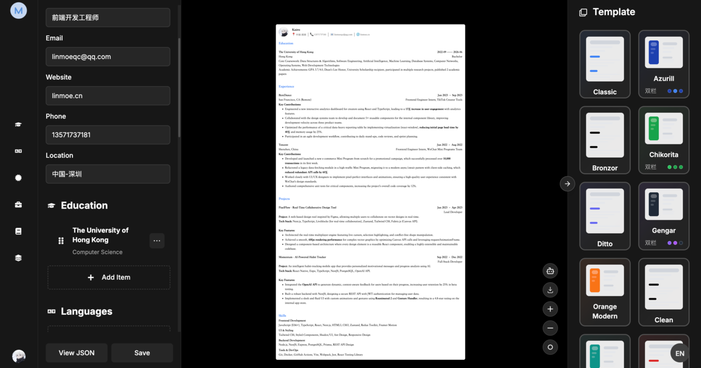

<div align="center">
  <a href="https://magic-resume.cn">
    
  </a>

  <h1>Magic Resume</h1>

  <p><strong>开源的 AI 简历工作台。</strong><br/>AI 就地提出修改建议，你逐条决定采纳或跳过。</p>

  <p>
    <a href="https://magic-resume.cn"><strong>立即开始 »</strong></a>
    &nbsp;·&nbsp;
    <a href="./README.md">English</a>
    &nbsp;·&nbsp;
    <a href="https://magic-resume.cn">官方网站</a>
    &nbsp;·&nbsp;
    <a href="https://github.com/Magic-Resume/Magic-Resume/issues">问题反馈</a>
  </p>

  <!-- SHIELD GROUP -->

  [![][vercel-shield]][vercel-link]
  [![][github-stars-shield]][github-stars-link]
  [![][github-forks-shield]][github-forks-link]
  [![][github-contributors-shield]][github-contributors-link]
  [![][github-issues-shield]][github-issues-link]
  [![][github-license-shield]][github-license-link]

</div>

<br/>



<br/>

**Magic Resume 是开源的 AI 简历工作台：AI 就地提出修改建议，你逐条决定采纳或跳过。** MIT 协议内核，19 套模板，六种工作模式（创建、优化、分析、翻译、面试、导出），多设备云同步。

它把实时可视化编辑器与多模型 AI 结合在一起，并更进一步 —— 内置原生 **MCP 服务**，让 AI 编程工具（Claude Code、Cursor、Windsurf）无需猜测数据结构即可安全读取与修改你的简历。

## 自部署版 vs 云端版

两种用法功能相同，差别只在数据存在哪里、AI 由谁供给。

| | 自部署（本仓库） | 云端版（magic-resume.cn） |
|---|---|---|
| 授权 | MIT，永久免费 | 免费额度 + 付费计划 |
| 账号 | 不需要 | 需要 |
| 数据存储 | 仅本机浏览器 IndexedDB | 加密云端存储，随时完整导出 |
| 多设备同步 | 不支持 | 默认开启 |
| 版本历史 | 本地快照 | 云端保留，可回滚 |
| AI 能力 | 自带 API Key | 内置，开箱即用 |
| 后端依赖 | 无需后端与数据库 | 由官方托管 |
| 模板 | 19 套，完全相同 | 19 套，完全相同 |

> [!NOTE]
> 自部署版全部在浏览器内运行，简历数据只保存在你自己的机器上。云端版默认开启多设备同步，数据加密传输与存储，随时可完整导出。

---

## 功能特性

**制作 —— 顺手的可视化编辑**

- **实时预览** —— 输入即所见，改动立刻呈现。
- **19 套专业模板** —— ATS 友好，颜色、字体、排版全可控。
- **深度自定义** —— 22+ 字体、间距与布局调节。
- **版本历史** —— 随时快照与回滚到任意历史版本。
- **简历分享** —— 通过唯一链接分享，支持 查看 / 评论 / 编辑 权限。

**分析 —— Lighthouse 式简历体检**

- **综合评分** —— 一个诚实、直观的简历竞争力评级。
- **细项拆解** —— 关键词匹配、可量化程度、可读性。
- **可执行建议** —— 给出具体的修改点，而非空泛套话。

**优化 —— 按岗位定向改写**

- **JD 匹配** —— AI 读取职位描述，据此定向重写内容。
- **自带模型** —— OpenAI、Google Gemini、Anthropic Claude、DeepSeek，或任意 OpenAI 兼容 API。

**AI 实验室 —— 不止于编辑**

- **模拟面试** —— 语音实战演练，AI 对回答给出反馈。
- **一键翻译** —— 保留排版，将简历翻译成任意语言。

**隐私 —— 数据始终属于你**

- **本地优先** —— 默认存储于 IndexedDB，无需账号。
- **可选云同步** —— 仅在你选择时，才在多设备间安全同步。
- **多格式导出** —— 高质量 PDF 或结构化 JSON。

---

## 简历模板

19 套精心打磨、ATS 友好的模板，每套均可完全自定义（颜色、字体、间距、排版）：

`classic` · `azurill` · `bronzor` · `chikorita` · `ditto` · `gengar` · `orange-modern` · `clean-minimal` · `teal-professional` · `red-accent` · `golden-elegant` · `product-ops-focus` · `compact-cn-photo` · `executive-band` · `timeline-pro` · `skills-first` · `serif-minimal` · `slate-sidebar` · `cn-formal-photo`

---

## MCP 集成

Magic Resume 内置原生 **Model Context Protocol（MCP）服务**（`@magic-resume/mcp`）—— 面向 AI 编程工具的一等集成。

用个人访问令牌配置一次，你的 AI 助手即可安全读取与修改简历，而无需直接操作原始数据库：

```bash
npx -y @magic-resume/mcp config set --api-url "https://your-api.example.com/api" --pat "mr_pat_xxx"
claude mcp add magic-resume -- npx -y @magic-resume/mcp mcp
```

| 工具 | 说明 |
|---|---|
| `list_resumes` | 列出账号下所有简历 |
| `get_resume` | 获取某份简历的完整内容 |
| `get_resume_schema` | 获取用于校验的 JSON Schema |
| `get_resume_editing_guide` | 面向 AI 的简历编辑指南 |
| `preview_resume_patch` | 预览 JSON Patch 而不实际应用 |
| `update_resume_content` | 应用 JSON Patch 更新简历内容 |

> [!TIP]
> 该服务基于 Schema、以 Patch 为核心 —— AI 工具做的是精准的局部修改，而非高风险的整篇重写。

---

## 技术栈

| 层 | 技术 |
|---|---|
| 单仓管理 | [Turborepo](https://turbo.build/)、[pnpm](https://pnpm.io/) |
| 框架 | [Next.js 15](https://nextjs.org/)（App Router） |
| 语言 | [TypeScript](https://www.typescriptlang.org/) |
| AI / LLM | [LangChain](https://www.langchain.com/)、[LangGraph](https://www.langchain.com/langgraph)、[Google GenAI](https://ai.google.dev/)、[Anthropic](https://www.anthropic.com/) |
| 鉴权 | [Clerk](https://clerk.com/)（仅云模式） |
| 样式 | [Tailwind CSS 4](https://tailwindcss.com/) |
| UI | [Radix UI](https://www.radix-ui.com/)、[Lucide](https://lucide.dev/) |
| 动效 | [Framer Motion](https://www.framer.com/motion/)、[GSAP](https://gsap.com/) |
| 状态 | [Zustand](https://zustand-demo.pmnd.rs/) |
| 存储 | [IndexedDB](https://developer.mozilla.org/en-US/docs/Web/API/IndexedDB_API) |
| 编辑器 | [Tiptap](https://tiptap.dev/)、[Monaco](https://microsoft.github.io/monaco-editor/) |
| MCP | [@modelcontextprotocol/sdk](https://modelcontextprotocol.io/) |
| Schema | [Zod](https://zod.dev/) |
| 国际化 | [i18next](https://www.i18next.com/) |

---

## 快速开始

Magic Resume 完全在浏览器中运行 —— 无需后端、无需数据库、无需账号。

```bash
git clone https://github.com/Magic-Resume/Magic-Resume.git
cd Magic-Resume
cp apps/web/.env.example apps/web/.env.local   # 设置 NEXT_PUBLIC_APP_MODE=self-hosted
pnpm install
pnpm run dev
```

打开 [http://localhost:3000](http://localhost:3000) 即可开始制作。

---

## 自托管

**自托管模式** 只需浏览器 —— 设置 `NEXT_PUBLIC_APP_MODE=self-hosted`（或留空），所有数据都保存在 IndexedDB。开源自托管版本不发送任何产品分析事件。

**云模式**（鉴权、云同步、分享）可一键部署：

[](https://vercel.com/new/clone?repository-url=https%3A%2F%2Fgithub.com%2FMagic-Resume%2FMagic-Resume)

> [!TIP]
> 云模式需在 Vercel 面板配置 `NEXT_PUBLIC_APP_MODE=cloud`、`NEXT_PUBLIC_CLERK_PUBLISHABLE_KEY` 与 `CLERK_SECRET_KEY`。

<details>
<summary><strong>环境变量</strong></summary>

<br/>

所有变量位于 `apps/web/.env.local`（从 `apps/web/.env.example` 拷贝）。以 `NEXT_PUBLIC_` 开头的值会在构建时内联进浏览器包 —— 切勿把密钥放在该前缀后面。

| 变量 | 适用模式 | 默认值 | 用途 |
|---|---|---|---|
| `NEXT_PUBLIC_APP_MODE` | 两者 | 自动 | `self-hosted` 或 `cloud`。自动判定：设置了 `NEXT_PUBLIC_CLERK_PUBLISHABLE_KEY` 即为 `cloud`，否则 `self-hosted`。 |
| `NEXT_PUBLIC_APP_URL` | 两者 | `https://magic-resume.cn` | 用于 OG / SEO 的规范基址。请设为你的部署源（开发环境可用 `http://localhost:3000`）。 |
| `NEXT_PUBLIC_CLERK_PUBLISHABLE_KEY` | 云 | — | Clerk 公钥（`pk_...`）。 |
| `CLERK_SECRET_KEY` | 云 | — | Clerk 私钥（`sk_...`）。 |
| `NEXT_PUBLIC_CLOUD_API_URL` | 云 | `http://localhost:3111` | NestJS Core API —— 简历、设置、分享、PAT。 |
| `BACKEND_URL` | AI 功能 | `http://localhost:8000` | Agent 服务 —— 面试、翻译、AI 优化 / 分析。 |

- **`self-hosted`** —— 纯浏览器。无 Clerk、无 Core API；仅 `NEXT_PUBLIC_APP_URL` 有意义。
- **`cloud`** —— 需两把 Clerk 密钥加 `NEXT_PUBLIC_CLOUD_API_URL`；AI 功能另需 `BACKEND_URL`。

</details>

---

## 单仓结构

本仓库是一个 Turborepo + pnpm 单仓（monorepo）。

| 包 | 说明 |
|---|---|
| `apps/web` | Next.js 前端 —— 编辑器、仪表盘、AI 实验室 |
| `packages/mcp` | `@magic-resume/mcp` —— stdio MCP 服务与 CLI |
| `packages/resume-schema` | 共享 Zod schema、类型与示例数据 |
| `packages/resume-templates` | 模板 DSL、渲染器与注册表 |

```bash
pnpm install            # 安装全部依赖
pnpm run dev            # 启动所有工作区
pnpm run lint           # 代码检查
pnpm run test           # 测试

# 指定单个工作区
pnpm --filter @magic-resume/web dev
pnpm --filter @magic-resume/mcp build
```

---

## 参与贡献

欢迎任何形式的贡献 —— 修复 Bug、新增模板、完善文档、补充翻译或开发新功能。

请先阅读 **[贡献指南](./CONTRIBUTING.zh-CN.md)** —— 其中包含本地启动、分支流程，以及强制执行的 **gitmoji + Conventional Commits** 提交规范。若是 Bug 或新想法，也欢迎先开一个 [Issue](https://github.com/Magic-Resume/Magic-Resume/issues) 讨论。

<a href="https://github.com/Magic-Resume/Magic-Resume/graphs/contributors">
  
</a>

---

## Star 趋势

<a href="https://star-history.com/#Magic-Resume/Magic-Resume&Date">
  
</a>

---

<div align="center">

版权所有 © 2026 [Magic Resume Team](https://github.com/Magic-Resume) · 基于 [MIT](./LICENSE) 许可证开源。

</div>

<!-- LINK GROUP -->

[official-site]: https://magic-resume.cn
[vercel-shield]: https://img.shields.io/badge/vercel-online-55b467?labelColor=black&logo=vercel&style=flat-square
[vercel-link]: https://magic-resume.cn
[github-contributors-shield]: https://img.shields.io/github/contributors/Magic-Resume/Magic-Resume?color=c4f042&labelColor=black&style=flat-square
[github-contributors-link]: https://github.com/Magic-Resume/Magic-Resume/graphs/contributors
[github-forks-shield]: https://img.shields.io/github/forks/Magic-Resume/Magic-Resume?color=8ae8ff&labelColor=black&style=flat-square
[github-forks-link]: https://github.com/Magic-Resume/Magic-Resume/network/members
[github-stars-shield]: https://img.shields.io/github/stars/Magic-Resume/Magic-Resume?color=ffcb47&labelColor=black&style=flat-square
[github-stars-link]: https://github.com/Magic-Resume/Magic-Resume/stargazers
[github-issues-shield]: https://img.shields.io/github/issues/Magic-Resume/Magic-Resume?color=ff80eb&labelColor=black&style=flat-square
[github-issues-link]: https://github.com/Magic-Resume/Magic-Resume/issues
[github-license-shield]: https://img.shields.io/badge/license-MIT-white?labelColor=black&style=flat-square
[github-license-link]: https://github.com/Magic-Resume/Magic-Resume/blob/master/LICENSE
